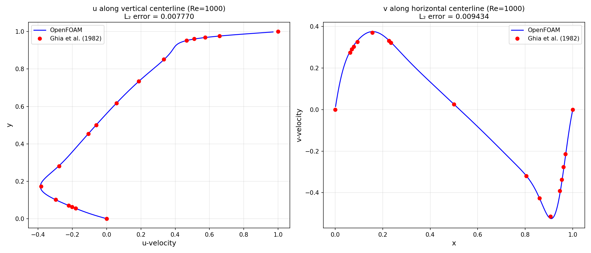
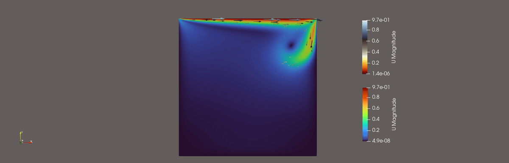

# Lid-Driven Cavity — Ghia et al. (1982) Validation

Validation of OpenFOAM against the classic **lid-driven cavity** benchmark from:

> Ghia, U. K. N. G., Ghia, K. N., & Shin, C. T. (1982). *High-Re solutions for incompressible flow using the Navier-Stokes equations and a multigrid method.* Journal of Computational Physics, 48(3), 387–411.

## Current Status

| Reynolds Number | Mesh | Solver | L₂ Error (u) | L₂ Error (v) | Status |
|:-:|:-:|:-:|:-:|:-:|:-:|
| 1000 | 257×257 | pimpleFoam (laminar) | 0.00777 | 0.00943 | ✅ Validated |

## Results



### Velocity Magnitude Evolution

The animation below shows the vortex formation and steady-state development over time:



*(50 time steps, 10 fps, ~1.9 MB source, 463 KB GIF)*

## Case Setup

- **Domain**: 1m × 1m square cavity (2D — `empty` BC on front/back)
- **Lid velocity**: u = 1 m/s (top wall, moving right)
- **Other walls**: no-slip (u = 0)
- **Kinematic viscosity**: ν = 1×10⁻³ m²/s → Re = UL/ν = 1000
- **Mesh**: 257×257 uniform hexahedral cells (`blockMesh`)
- **Solver**: `pimpleFoam` with `simulationType laminar`
- **Temporal**: adaptive Δt with `maxCo 0.5`, endTime = 100s

## How to Run

### Prerequisites
- OpenFOAM 13 (Foundation version) — adjust paths for other versions

### Steps

```bash
# 1. Source OpenFOAM environment
source /opt/openfoam13/etc/bashrc

# 2. Generate mesh
blockMesh

# 3. Run solver
pimpleFoam > log &

# 4. Write cell centres (for post-processing)
foamPostProcess -latestTime -func writeCellCentres

# 5. Extract centerline profiles and compare with Ghia
python3 scripts/compare_ghia.py
```

## Post-Processing

The Python script `scripts/compare_ghia.py`:

1. Reads the latest OpenFOAM time directory
2. Extracts u-velocity along the vertical centerline (x = 0.5)
3. Extracts v-velocity along the horizontal centerline (y = 0.5)
4. Interpolates to Ghia's 17 benchmark points
5. Computes L₂ norm error
6. Plots OpenFOAM profiles against Ghia data

### Requirements
```bash
pip install numpy matplotlib
```

## Project Structure

```
├── 0/                          # Initial conditions
│   ├── U                       # Velocity field
│   └── p                       # Pressure field
├── constant/
│   ├── physicalProperties      # Kinematic viscosity
│   └── momentumTransport       # Laminar simulation
├── system/
│   ├── blockMeshDict           # Mesh definition (257×257)
│   ├── controlDict             # Time stepping, maxCo = 0.5
│   ├── fvSchemes               # Discretization schemes
│   └── fvSolution              # Linear solver settings (PIMPLE)
├── scripts/
│   └── compare_ghia.py         # Validation comparison script
├── postProcessing/results/
│   ├── ghia_comparison_Re1000.png
│   └── cavity_Re1000.gif
└── README.md
```

## What I Changed from the Default Tutorial (and Why)

The OpenFOAM cavity tutorial is a 20×20 mesh on a 0.1m domain — it's a toy. Running it as-is produces garbage compared to Ghia. Here's everything I modified and the reasoning:

1. **Domain size** — Changed `convertToMeters` from `0.1` to `1` to match Ghia's 1×1 benchmark geometry. Also adjusted ν from 1×10⁻⁵ to 1×10⁻³ to keep Re = 1000 (= UL/ν) consistent with the new domain size.

2. **Mesh refinement** — 20×20 → 257×257. The tutorial mesh is far too coarse for any meaningful comparison — the primary vortex is barely resolved. 257×257 gives cell size ≈ 3.9mm, sufficient for Re=1000.

3. **Solver switch** — The tutorial ships with turbulence model files (`k`, `omega`, `epsilon`, `nut`, `nuTilda`) and `PIMPLE` in `fvSolution`. At Re=1000, the flow is laminar — turbulence models add unnecessary diffusion. I set `simulationType laminar;` and removed the turbulence field files. Initially tried `icoFoam` (PISO-only) but it crashed because `fvSolution` only had a `PIMPLE` sub-dictionary, not `PISO`.

4. **Time step control** — The tutorial had a fixed `deltaT = 0.005`. On a 257×257 mesh (Δx ≈ 0.00389m), this gives Courant number ≈ 1.28 — above the stability limit. The original run to t=10s produced L₂ errors of 0.13 (terrible). I added `adjustTimeStep yes` with `maxCo 0.5` and extended `endTime` to 100s (~100 flow-through times) to reach steady state. This dropped L₂ error from 0.13 → 0.008.

5. **Post-processing** — Wrote a Python script to parse OpenFOAM field files directly, extract centerline velocity profiles, interpolate onto Ghia's 17 benchmark points, and compute L₂ error. OpenFOAM 13's `sample` utility was superseded by `foamPostProcess`, so I used `writeCellCentres` + custom Python instead.

## Roadmap

- [ ] Re = 100, 400, 1000, 3200, 5000, 7500, 10000 — automated parameter sweep
- [ ] Grid convergence study (65×65, 129×129, 257×257, 513×513)
- [ ] Automated Python pipeline for running + post-processing all cases
- [ ] Streamfunction and vorticity contours
- [ ] Corner vortex resolution analysis

## References

1. Ghia, U., Ghia, K. N., & Shin, C. T. (1982). High-Re solutions for incompressible flow using the Navier-Stokes equations and a multigrid method. *Journal of Computational Physics*, 48(3), 387–411.
2. [OpenFOAM Foundation v13](https://openfoam.org/version/13/)
